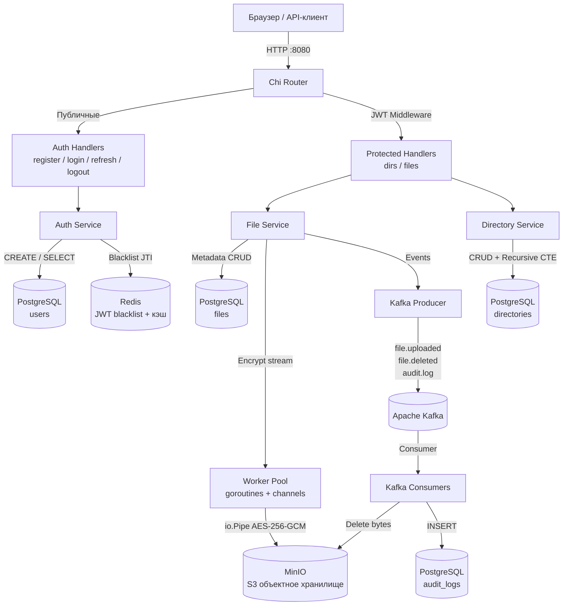

# Cloud Encryption File Storage

<p align="center">
  
  
  
  
  
  
  
</p>

<p align="center">
  <strong>Облачное хранилище файлов с сквозным AES-256-GCM шифрованием, JWT аутентификацией и event-driven архитектурой на Go.</strong>
</p>

---

## Содержание

- [О проекте](#о-проекте)
  - [Для пользователей](#для-пользователей)
  - [Для разработчиков](#для-разработчиков)
- [Архитектура системы](#архитектура-системы)
  - [Схема компонентов](#схема-компонентов)
  - [Поток данных при загрузке файла](#поток-данных-при-загрузке-файла)
- [Технологический стек](#технологический-стек)
- [Быстрый старт](#быстрый-старт)
  - [Требования](#требования)
  - [1. Клонировать и настроить](#1-клонировать-и-настроить)
  - [2. Запуск через Docker Compose](#2-запуск-через-docker-compose)
  - [3. Локальный запуск (только инфраструктура в Docker)](#3-локальный-запуск-только-инфраструктура-в-docker)
- [Конфигурация](#конфигурация)
- [API Reference](#api-reference)
  - [Auth](#auth-apiauthресурс)
  - [Directories](#directories-apidirs)
  - [Files](#files-apifiles)
  - [Service](#service-endpoints)
- [Устранение неполадок](#устранение-неполадок)

---

## О проекте

**Cloud Encryption File Storage** — backend-сервис на Go для безопасного хранения файлов. Каждый файл шифруется алгоритмом AES-256-GCM прямо в потоке перед записью в объектное хранилище — сервер никогда не хранит незашифрованные байты на диске.

### Для пользователей

- **Сквозное шифрование**: файлы шифруются на сервере ключом AES-256 до попадания в хранилище. Без ключа — нечитаемый набор байт.
- **Иерархия папок**: создавай вложенные директории любой глубины, загружай и скачивай файлы.
- **Безопасная аутентификация**: access + refresh токены, мгновенный logout через Redis blacklist — токен инвалидируется до истечения срока.
- **Веб-интерфейс**: встроенный минималистичный UI доступен прямо в браузере, без отдельной установки.

### Для разработчиков

- **Чистая архитектура**: строгое разделение на слои — `model → repository → service → handler`. Каждый слой зависит только от интерфейсов, не от конкретных реализаций.
- **Конкурентная обработка**: Worker Pool на goroutines + channels ограничивает параллельное шифрование. Стриминг через `io.Pipe` — весь файл никогда не оказывается в памяти целиком.
- **Event-Driven**: Kafka-события `file.uploaded` / `file.deleted` / `audit.log` для асинхронной очистки хранилища и аудита.
- **Надёжный PostgreSQL**: pgxpool (пул соединений), golang-migrate (версионируемые миграции), рекурсивный CTE для обхода дерева директорий, soft delete для файлов.
- **Redis NoSQL**: JWT blacklist с TTL, универсальный кэш, атомарный rate-limit counter через pipeline.

---

## Архитектура системы

### Схема компонентов



### Поток данных при загрузке файла

1. **HTTP Multipart**: клиент отправляет `POST /api/files` с файлом и `directory_id`.
2. **JWT Middleware**: проверяет подпись токена и отсутствие JTI в Redis blacklist (O(1)).
3. **File Service**: валидирует input, генерирует `fileID` и `storageKey`.
4. **Worker Pool**: задача попадает в буферизованный канал; свободная горутина берёт её.
5. **io.Pipe + AES-256-GCM**: горутина-шифратор пишет в `PipeWriter`, MinIO читает из `PipeReader` — данные стримятся без буферизации в RAM.
6. **PostgreSQL**: после успешной загрузки сохраняются метаданные (имя, размер, mime, storage key).
7. **Kafka**: асинхронно публикуется событие `file.uploaded` — другие сервисы могут реагировать.

---

## Технологический стек

| Компонент | Технология | Роль |
| :--- | :--- | :--- |
| **HTTP сервер** | Go 1.25, [chi v5](https://github.com/go-chi/chi) | Роутер с middleware-стеком, URL-параметры, группы маршрутов |
| **База данных** | PostgreSQL 16, [pgx v5](https://github.com/jackc/pgx) | Хранение метаданных, pgxpool (пул соединений), миграции |
| **NoSQL** | Redis 7, [go-redis v9](https://github.com/redis/go-redis) | JWT blacklist с TTL, кэш, rate-limit pipeline |
| **Объектное хранилище** | MinIO, [minio-go v7](https://github.com/minio/minio-go) | S3-совместимое хранение зашифрованных байт файлов |
| **Message Broker** | Apache Kafka, [kafka-go](https://github.com/segmentio/kafka-go) | Асинхронные события: upload, delete, audit |
| **Шифрование** | AES-256-GCM (`crypto/cipher`) | Потоковое шифрование чанками по 32KB через io.Pipe |
| **Аутентификация** | JWT HS256, [golang-jwt v5](https://github.com/golang-jwt/jwt) | Access (15 мин) + Refresh (7 дней) токены, JTI blacklist |
| **Хеширование паролей** | bcrypt (`golang.org/x/crypto`) | DefaultCost=10, защита от brute-force |
| **Конкурентность** | goroutines, channels, sync.WaitGroup, sync.Once | Worker Pool, graceful shutdown, errgroup для параллельных запросов |
| **Миграции** | [golang-migrate v4](https://github.com/golang-migrate/migrate) | Версионируемые SQL-миграции, отслеживание через schema_migrations |
| **Контейнеризация** | Docker, Docker Compose | Multi-stage build (distroless), оркестрация всех сервисов |
| **Метрики** | Prometheus, Grafana | Счётчики запросов, гистограммы латентности |
| **Логирование** | `log/slog` (stdlib Go 1.21+) | Структурированные JSON-логи |

---

## Быстрый старт

### Требования

- **Docker** и **Docker Compose**
- **Go 1.25+** (только для локального запуска)

---

### 1. Клонировать и настроить

```bash
git clone <repository-url>
cd managerFiles

cp .env.example .env
```

Отредактируй `.env`. Обязательные поля:

```env
# PostgreSQL
DB_PASSWORD=your_password

# JWT — сгенерировать: openssl rand -base64 48
JWT_SECRET=your_jwt_secret

# AES-256 ключ шифрования — сгенерировать: openssl rand -hex 32
ENCRYPTION_KEY=your_64_hex_chars_here
```

---

### 2. Запуск через Docker Compose

Запускает всё: PostgreSQL, Redis, MinIO, Kafka, Kafka UI, Prometheus, Grafana и сам Go-сервер.

```bash
docker compose up -d --build
```

Проверить что всё поднялось (~1-2 минуты):

```bash
docker compose ps
```

Открыть в браузере:

| Сервис | URL |
| :--- | :--- |
| **Веб-интерфейс** | http://localhost:8080 |
| **MinIO Console** | http://localhost:9001 (minioadmin / minioadmin) |
| **Kafka UI** | http://localhost:8090 |
| **Grafana** | http://localhost:3000 (admin / admin) |
| **Prometheus** | http://localhost:9090 |

---

### 3. Локальный запуск (только инфраструктура в Docker)

Удобно при разработке — сервис запускается без пересборки Docker-образа.

```bash
# Запустить только инфраструктуру
docker compose up -d postgres redis minio zookeeper kafka kafka-ui

# Подождать ~30 секунд пока Kafka поднимется, затем:
go run ./cmd/server
```

> [!NOTE]
> При локальном запуске убедись что в `.env` указано `KAFKA_BROKERS=localhost:29092` (не `kafka:9092` — это внутренний Docker-адрес).

> [!TIP]
> Если Kafka не нужна прямо сейчас, добавь `KAFKA_ENABLED=false` в `.env` — consumers не запустятся, остальное работает полностью.

---

## Конфигурация

Все параметры задаются через переменные окружения (файл `.env`). Шаблон — `.env.example`.

| Переменная | Описание | Пример |
| :--- | :--- | :--- |
| `SERVER_PORT` | Порт HTTP сервера | `8080` |
| `LOG_LEVEL` | Уровень логов: debug / info / warn / error | `info` |
| `DB_HOST` | Хост PostgreSQL | `localhost` |
| `DB_PASSWORD` | Пароль PostgreSQL | — |
| `DB_NAME` | Имя базы данных | `managerFiles` |
| `REDIS_ADDR` | Адрес Redis | `localhost:6379` |
| `MINIO_ENDPOINT` | Адрес MinIO | `localhost:9000` |
| `MINIO_BUCKET` | Имя бакета | `files` |
| `KAFKA_BROKERS` | Адрес брокера (локально: 29092) | `localhost:29092` |
| `KAFKA_ENABLED` | Запускать ли Kafka consumers | `true` |
| `JWT_SECRET` | Секрет подписи JWT токенов | `openssl rand -base64 48` |
| `JWT_ACCESS_TTL` | Время жизни access токена | `15m` |
| `JWT_REFRESH_TTL` | Время жизни refresh токена | `168h` |
| `ENCRYPTION_KEY` | AES-256 ключ (64 hex символа = 32 байта) | `openssl rand -hex 32` |
| `WORKER_COUNT` | Горутин в пуле шифрования | `5` |

---

## API Reference

Все защищённые маршруты требуют заголовок:
```
Authorization: Bearer <access_token>
```

### Auth (`/api/auth/...`)

| Метод | Маршрут | Тело запроса | Ответ | Описание |
| :---: | :--- | :--- | :--- | :--- |
| `POST` | `/api/auth/register` | `{username, email, password}` | `201 UserResponse` | Регистрация |
| `POST` | `/api/auth/login` | `{email, password}` | `200 TokenPair` | Вход, получить токены |
| `POST` | `/api/auth/refresh` | `{refresh_token}` | `200 TokenPair` | Обновить пару токенов |
| `POST` | `/api/auth/logout` | — | `204` | Выход, инвалидировать access токен |

**TokenPair:**
```json
{
  "access_token":  "eyJhbGci...",
  "refresh_token": "eyJhbGci...",
  "expires_at":    "2026-05-19T16:00:00Z"
}
```

---

### Directories (`/api/dirs`)

| Метод | Маршрут | Тело запроса | Ответ | Описание |
| :---: | :--- | :--- | :--- | :--- |
| `GET` | `/api/dirs` | — | `200 []DirectoryResponse` | Корневые директории пользователя |
| `POST` | `/api/dirs` | `{name, parent_id}` | `201 DirectoryResponse` | Создать директорию (`parent_id: null` → корневая) |
| `GET` | `/api/dirs/{id}` | — | `200 DirectoryContents` | Содержимое: сама папка + подпапки + файлы |
| `DELETE` | `/api/dirs/{id}` | — | `204` | Удалить каскадно (ON DELETE CASCADE) |

**DirectoryContents:**
```json
{
  "directory":   { "id": "...", "name": "Документы", "parent_id": null },
  "directories": [ { "id": "...", "name": "Отчёты" } ],
  "files":       [ { "id": "...", "original_name": "report.pdf", "size_bytes": 102400 } ]
}
```

---

### Files (`/api/files`)

| Метод | Маршрут | Тело запроса | Ответ | Описание |
| :---: | :--- | :--- | :--- | :--- |
| `POST` | `/api/files` | `multipart/form-data: file, directory_id, encrypt` | `201 FileResponse` | Загрузить файл (шифрование по умолчанию) |
| `GET` | `/api/files/{id}` | — | `200 binary stream` | Скачать файл (расшифровывается на лету) |
| `HEAD` | `/api/files/{id}` | — | Заголовки | Метаданные без скачивания |
| `DELETE` | `/api/files/{id}` | — | `204` | Soft delete + Kafka событие для очистки MinIO |

**FileResponse:**
```json
{
  "id":            "f7761152-...",
  "directory_id":  "a1b2c3d4-...",
  "original_name": "document.pdf",
  "size_bytes":    204800,
  "mime_type":     "application/pdf",
  "is_encrypted":  true,
  "created_at":    "2026-05-19T14:00:00Z"
}
```

---

### Service endpoints

| Метод | Маршрут | Описание |
| :---: | :--- | :--- |
| `GET` | `/health` | Liveness probe — сервис жив |
| `GET` | `/ready` | Readiness probe — PostgreSQL и Redis доступны |
| `GET` | `/metrics` | Prometheus метрики |
| `GET` | `/` | Встроенный веб-интерфейс |

---

## Устранение неполадок

### `panic: ENCRYPTION_KEY: неверный hex формат`

**Причина**: в `.env` стоит значение-заглушка вместо реального ключа.

**Решение**: сгенерировать валидный ключ и прописать в `.env`:
```bash
openssl rand -hex 32
# вставить результат в ENCRYPTION_KEY=...
```

---

### MinIO недоступен при старте

**Симптом**: `level=WARN msg="MinIO недоступен, загрузка файлов будет недоступна"`.

**Поведение**: сервер **продолжает работу** — auth и директории работают полностью, загрузка/скачивание файлов возвращает ошибку.

**Решение**: убедиться что MinIO запущен:
```bash
docker compose up -d minio
```

---

### Kafka бесконечно не подключается

**Симптом**: `level=WARN msg="Kafka недоступна, повтор через 5с"` в бесконечном цикле.

**Решение A** — отключить Kafka для локальной разработки:
```env
KAFKA_ENABLED=false
```

**Решение B** — запустить Kafka через Docker Compose:
```bash
docker compose up -d zookeeper kafka
# подождать ~30 секунд
docker compose ps  # kafka: healthy
```

---

### `cipher: message authentication failed` при скачивании

**Причина**: файл был загружен версией кода с другим алгоритмом формирования nonce.

**Решение**: удалить файл и загрузить заново. Все файлы загруженные текущей версией расшифровываются корректно.

---

### PostgreSQL: миграции не применяются

**Симптом**: `проблемы с созданием миграции` при старте.

**Решение**: убедиться что сервер запущен из корня проекта (там где лежит папка `migration/`):
```bash
# Правильно:
go run ./cmd/server

# Неправильно (путь к миграциям не найдётся):
cd cmd/server && go run .
```
